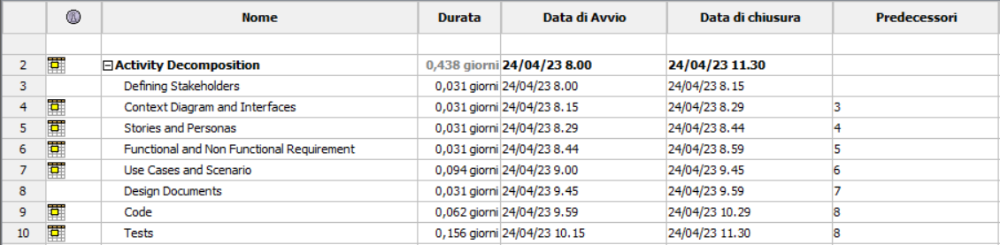
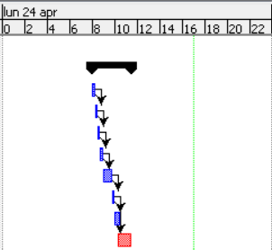

# Project Estimation - FUTURE
Date: 24/04/2023

Version: 1.0

# Estimation approach
Consider the EZWallet  project in FUTURE version (as proposed by the team), assume that you are going to develop the project INDEPENDENT of the deadlines of the course
# Estimate by size
### 
|             | Estimate                        |             
| ----------- | ------------------------------- |  
| NC =  Estimated number of classes to be developed   |                 8          |             
|  A = Estimated average size per class, in LOC       |                17            | 
| S = Estimated size of project, in LOC (= NC * A) | 136 |
| E = Estimated effort, in person hours (here use productivity 10 LOC per person hour)  |              13,6                        |   
| C = Estimated cost, in euro (here use 1 person hour cost = 30 euro) | 408 | 
| Estimated calendar time, in calendar weeks (Assume team of 4 people, 8 hours per day, 5 days per week ) |     0,085       |               

# Estimate by product decomposition
### 
|         component name    | Estimated effort (person hours)   |             
| ----------- | ------------------------------- | 
|requirement document    | 3 |
| GUI prototype | 2 |
|design document | 1  |
|code |  2 |
| unit tests | 3 |
| api tests | 3 |
| management documents  | 1 |

# Estimate by activity decomposition
### 
|         Activity name    | Estimated effort (person hours)   |             
| ----------- | ------------------------------- | 
| Defining Stakeholders | 1 |
| Context Diagram and Interfaces | 1 |
| Stories and Personas | 1 |
| Functional and Non Functional Requirement | 1 |
| Use Cases and Scenario | 3 |
| Design Documents | 1 |
| code | 2 |
| tests | 5 |
###

# Summary

Report here the results of the three estimation approaches. The  estimates may differ. Discuss here the possible reasons for the difference

|             | Estimated effort                        |   Estimated duration |          
| ----------- | ------------------------------- | ---------------|
| estimate by size | 13,6 |  0,085 calendar weeks |
| estimate by product decomposition | 15 | 0,094 calendar weeks |
| estimate by activity decomposition | 15 | 0,094 calendar weeks |

