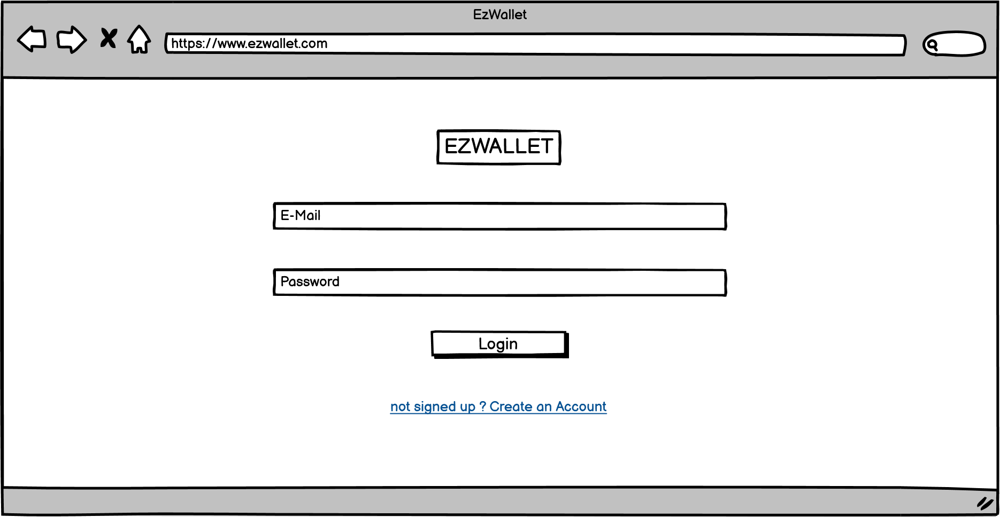
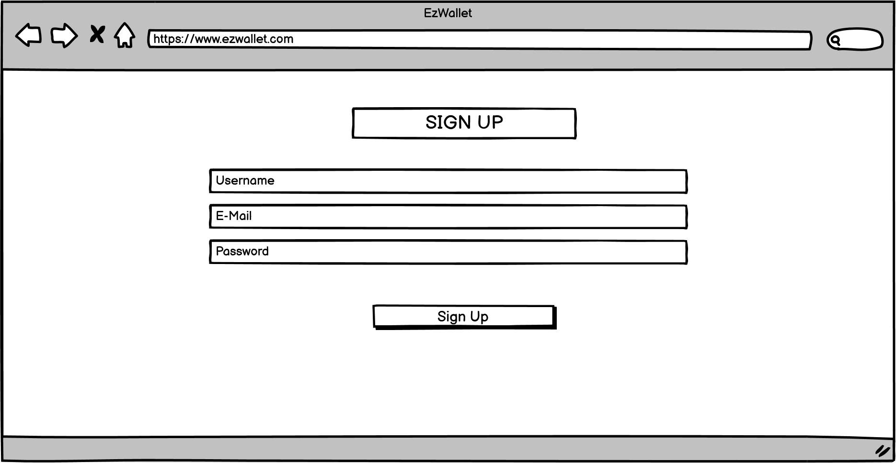
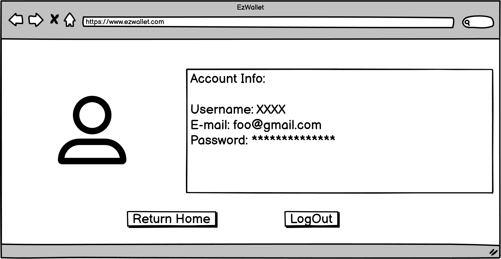
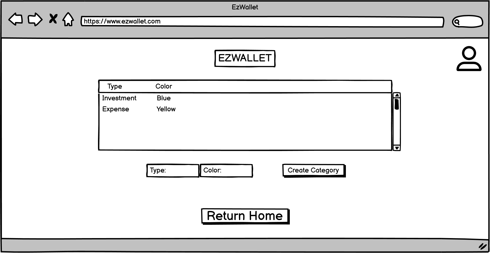
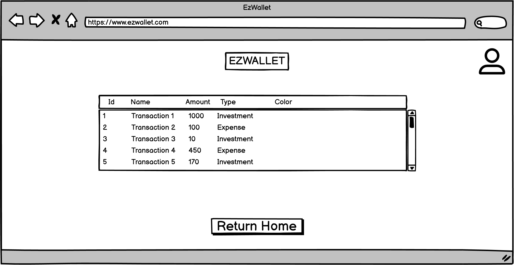

# Graphical User Interface Prototype  - CURRENT

Authors: Domenico Gagliardo, Agostino Saviano, Gaetano Roberto, Serigne Cheikh Fall

Date: 21/04/2023

Version: 1.0

# ACCESS PAGE
From here the User can enter E-Mail, Password and click the "Login" button to go to the [HOME PAGE](#home-page), or click on "not signed up? Create an Account" Link to go to the [CREATE ACCOUNT](#create-account).

# CREATE ACCOUNT
The non-registered User enters Username, E-Mail and Password. After that, by clicking on the "Sign Up" button the User can go to the [HOME PAGE](#home-page).

# HOME PAGE 
From here the User can see all the transactions. Here he can add a Transaction by clicking on "Create Transaction" button. He can also go to: 
1) [USER SETTINGS](#user-settings) by clicking on the settings icon.
2) [USERS INFORMATION](#users-information) by clicking on the "GetUsers" button.
3) [MANAGE CATEGORIES](#manage-categories) by clicking on the "Show Categories" button.
4) [MANAGE LABELS](#manage-labels) by clicking on the "Show Labels" button.   

# USER SETTINGS
From here the User can see his account information (Username, e-mail and password). He can also go to [ACCESS PAGE](#access-page) by clicking on the "Logout" button, or to [HOME PAGE](#home-page) by clicking on the "Return Home" button.

# USERS INFORMATION
From here the User can see all the information of all the application users. He can also go to: 
1) [USER SETTINGS](#user-settings) by clicking on the settings icon.
2) [HOME PAGE](#home-page) by clicking on the "Return Home" button.

# MANAGE CATEGORIES
From here the User can see all the categories. He can also add a category by clicking on the "Create Category" button. He can also go to: 
1) [USER SETTINGS](#user-settings) by clicking on the settings icon.
2) [HOME PAGE](#home-page) by clicking on the "Return Home" button.

# MANAGE LABELS
From here the User can see all the labels. He can also go to: 
1) [USER SETTINGS](#user-settings) by clicking on the settings icon.
2) [HOME PAGE](#home-page) by clicking on the "Return Home" button.

