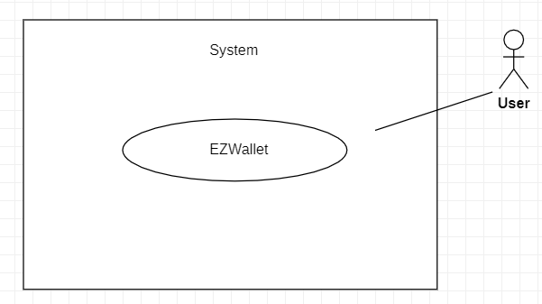
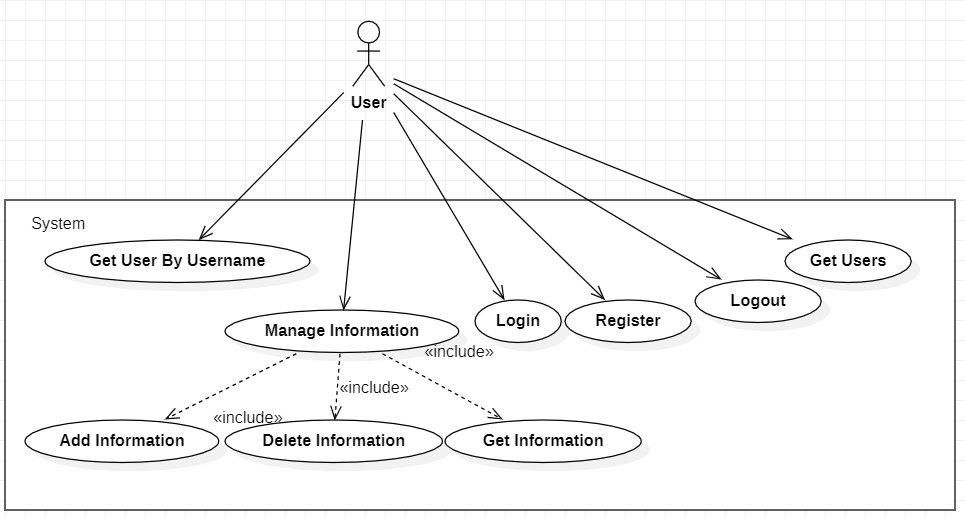
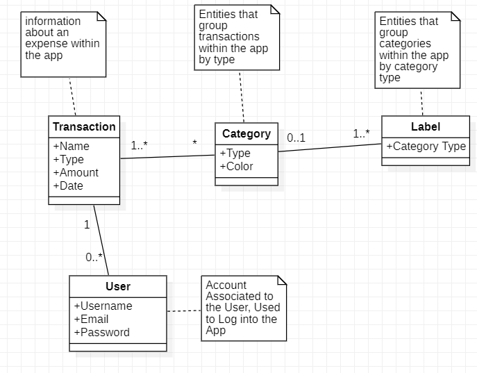
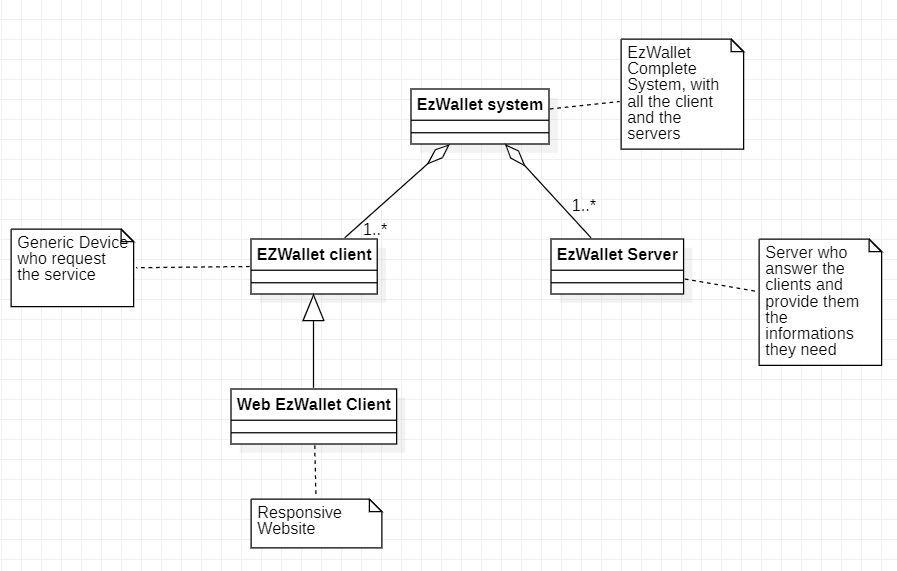
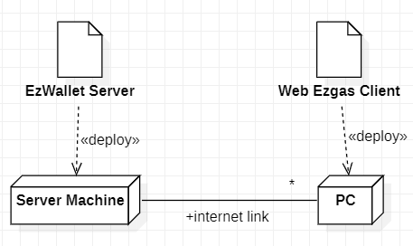

# Requirements Document - current EZWallet

Date: 21/04/2023

Version: V1 - description of EZWallet in CURRENT form (as received by teachers)

 
| Version number | Change |
| ----------------- |:-----------|
| 1.0 | Stakeholders, Context Diagram, Interfaces, stories and Personas |
| 1.1 | Functional/ Non Funtional Requirements |
| 1.2 | Use Cases and Scenarios |
| 1.3 | Diagrams |
| 1.4 | Corrections |
| 1.5 | Corrections |

# Contents

- [Informal description](#informal-description)
- [Stakeholders](#stakeholders)
- [Context Diagram and interfaces](#context-diagram-and-interfaces)
	+ [Context Diagram](#context-diagram)
	+ [Interfaces](#interfaces) 
	
- [Stories and personas](#stories-and-personas)
- [Functional and non functional requirements](#functional-and-non-functional-requirements)
	+ [Functional Requirements](#functional-requirements)
	+ [Non functional requirements](#non-functional-requirements)
- [Use case diagram and use cases](#use-case-diagram-and-use-cases)
	+ [Use case diagram](#use-case-diagram)
	+ [Use cases](#use-cases)
    	+ [Relevant scenarios](#relevant-scenarios)
- [Glossary](#glossary)
- [System design](#system-design)
- [Deployment diagram](#deployment-diagram)

# Informal description
EZWallet (read EaSy Wallet) is a software application designed to help individuals and families keep track of their expenses. Users can enter and categorize their expenses, allowing them to quickly see where their money is going. EZWallet is a powerful tool for those looking to take control of their finances and make informed decisions about their spending.
## Business Model
EzWallet is a free-to-use app. It's implemented with a desktop GUI, that allows the user to easily perform all the activities related to his expenses. 

# Stakeholders

| Stakeholder name  | Description | 
| ----------------- |:-----------:|
|   StakeHolder1: Owner    |    investor, owns the product     |
|   StakeHolder2: User    |    person interested in charting its expenses      |
|   StakeHolder3: DB Administrator    |    person in charge of managing the DB     |
|   StakeHolder4: Developer   | person in charge of developing the software product  |

# Context Diagram and interfaces

## Context Diagram

## Interfaces
| Actor | Logical Interface | Physical Interface  |
| ------------- |:-------------:| -----:|
|   User     | PC | Graphical User Interface (to be defined) |

# Stories and personas
- Persona 1: High income professional, male, married, with no children, 40 yo
	+ Story: He thought that invest into this type of application could be profitable. Every month he checks how the project is going.
- Persona 2: Professional, female, divorced, with children, 40 yo
	+ Story: She needs to monitor her expenses, interested in understanding where her money has been spent.
- Persona 3: Student, worker part-time, male, 22, low income
	+ Story: Off-campus student interested in managing his finances better, since he has a part-time job but monthly expenses.
- Persona 4: Student, female, 22, no income 
	+ Story: Student Offsite, interested in managing the money her family sends her.

# Functional and non functional requirements

## Functional Requirements

| ID        | Description  |
| ------------- |:-------------:| 
|  F1     | Authorize and Authenticate |
|  F1.1     | Log In |
|  F1.2  | Log Out |
|  F1.3	|	Create Account	|
|  F2 | Manage Expenses |
|  F2.1 | Manage Categories |
|  F2.1.1| Create Category |
|  F2.1.2| Get Categories |
|  F2.2 | Manage Transactions |
|  F2.2.1| Create Transaction |
|  F2.2.2| Get Transactions |
|  F2.2.3| Delete Transaction |
|  F2.3 | Manage Labels |
|  F2.3.1| Get Labels |
|  F3    | Manage User Information |
|  F3.1	|	Get Users	|
|  F3.2	|	Get User By Username	|

## Non Functional Requirements

| ID        | Type (efficiency, reliability, ..)           | Description  | Refers to |
| ------------- |:-------------:| :-----:| -----:|
|  NFR1     | Efficiency | Each function less than ½ sec | F1,F2 |
|  NFR2     | Portability | Currency is Euro | F2.2,F2.3 |
|  NFR3     | Usability | Training Time 1 Hour, Average Number of Errors less than 2 | F1,F2 |

# Use case diagram and use cases

## Use case diagram

### Use case 1, UC1 (Register)
| Actors Involved        | User |
| ------------- |:-------------:| 
|  Precondition     | <u>User</u> opened the application |
|  Post condition     | <u>User</u> is registered |
|  Nominal Scenario     | <u>User</u>, initially on the page, decides to register for the first time. |
|  Variants     | <u>User</u> is already registered |
|  Exceptions     |  |

##### Scenario 1.1

| Scenario 1.1 | Register |
| ------------- |:-------------:| 
|  Precondition     | <u>User</u> is not registered |
|  Post condition     | <u>User</u> is registered and logged in |
| Step#        | Description  |
|  1     | <u>User</u> clicks "not signed up? Create an account" link. |  
|  2     | <u>User</u> enters username, e-mail and password  |  
|  3     | <u>User</u> clicks "sign up" button. |  
|  4     | System confirm the registration after checking if the user doesn't exists. |
|  5     | <u>User</u> is logged. |  

##### Scenario 1.2

| Scenario 1.2 |  User already exists |
| ------------- |:-------------:| 
|  Precondition     | <u>User</u> is not registered |
|  Post condition     | <u>User</u> is not registered  |
| Step#        | Description  |
|  1     | <u>User</u> enters username,email and password. |  
|  2     | Email found in the database. |
|  3     | System asks again the data. |

### Use case 2, UC2 (Login)
| Actors Involved        | User |
| ------------- |:-------------:| 
|  Precondition     | <u>User</u> opened the application |
|  Post condition     | <u>User</u> is logged |
|  Nominal Scenario     | <u>User</u>, initially on the page, decides to login. |
|  Variants     | <u>User</u> is not registered  |
|  Exceptions     | wrong username or password |

##### Scenario 2.1 

| Scenario 2.1 | Login |
| ------------- |:-------------:| 
|  Precondition     | <u>User</u> is registered and not logged in |
|  Post condition     | <u>User</u> is Logged In and can access his account |
| Step#        | Description  |
|  1     | <u>User</u> enters email and password. |  
|  2     | <u>User</u> confirms the login by clicking on the "Login" button. |

##### Scenario 2.2

| Scenario 2.2 | Wrong password  |
| ------------- |:-------------:| 
|  Precondition     | <u>User</u> is not logged in |
|  Post condition     | <u>User</u> is  not logged in |
| Step#        | Description  |
|  1     | <u>User</u> enters email and password. |  
|  2     | Password is wrong. |
|  3     | System asks again the data. |

##### Scenario 2.3

| Scenario 2.3 | User doesn't exists  |
| ------------- |:-------------:| 
|  Precondition     | <u>User</u> is not logged in |
|  Post condition     | <u>User</u> is  not logged in |
| Step#        | Description  |
|  1     | <u>User</u> enters email and password. |  
|  2     | Email not found in the database |
|  3     | System asks again the data. |

### Use case 3, UC3 Logout
| Actors Involved        | User |
| ------------- |:-------------:| 
|  Precondition     | <u>User</u> is already logged in |
|  Post condition     | <u>User</u> is logged out |
|  Nominal Scenario     | <u>User</u>, initially logged in, decides to logout. |
|  Variants     |  |
|  Exceptions     |  |

##### Scenario 3.1

| Scenario 3.1 | Logout |
| ------------- |:-------------:| 
|  Precondition     | <u>User</u> is already logged in |
|  Post condition     | <u>User</u> is logged out |
| Step#        | Description  |
|  1     | <u>User</u> clicks the settings icon. |  
|  2     | <u>User</u> clicks the logout button. |  
|  3     | System confirms the logout. |

### Use case 4, UC4 (Get Information)

| Actors Involved        | User |
| ------------- |:-------------:| 
|  Precondition     | <u>User</u> is logged in and wants to see all categories/labels/transaction inserted. |
|  Post condition     | <u>User</u> retrieves the information he wants. |
|  Nominal Scenario     | <u>User</u>, initially logged in on the page, wants to find information by clicking on the relative button. |
|  Variants     | <u>User</u> wants to see all categories.  <u>User</u> wants to see all labels.   <u>User</u> wants to see all transaction.  |
|  Exceptions     |  |

##### Scenario 4.1 

| Scenario 4.1 | Get Categories |
| ------------- |:-------------:| 
|  Precondition     | <u>User</u> is logged in and clicked "show categories" button. |
|  Post condition     | All categories are displayed. |
| Step#        | Description  |
|  1     | <u>User</u> clicks the "show categories" button. |
|  2     | System shows all categories to the <u>User</u>. |

##### Scenario 4.2

| Scenario 4.2 | Get Labels |
| ------------- |:-------------:| 
|  Precondition     | <u>User</u> is logged in and clicked "show labels" button. |
|  Post condition     |  All labels are displayed. |
| Step#        | Description  |
|  1     | <u>User</u> clicks the "show labels" button. |
|  2     | System shows all labels to the <u>User</u>. |

##### Scenario 4.3

| Scenario 4.3 | Get Transaction |
| ------------- |:-------------:| 
|  Precondition     | <u>User</u> is logged in. |
|  Post condition     |  All transaction are displayed. |
| Step#        | Description  |
|  1     | System shows automatically all transactions to the <u>User</u>. |

### Use case 5, UC5 (Add Information)

| Actors Involved        | User |
| ------------- |:-------------:| 
|  Precondition     | <u>User</u> is logged in and want to Add specific information. |
|  Post condition     | <u>User</u> Adds the information he wants. |
|  Nominal Scenario     | <u>User</u>, initially logged in on the page, wants to Add something by clicking on the relative button. |
|  Variants     | <u>User</u> wants to Add a category.  <u>User</u> wants to Add a transaction.  |
|  Exceptions     | Category or Transaction are already present. |

##### Scenario 5.1 
| Scenario 5.1 | Create Category |
| ------------- |:-------------:| 
|  Precondition     | <u>User</u> is logged in |
|  Post condition     | A Category is added successfully. |
| Step#        | Description  |
|  1     | <u>User</u> clicks the "show categories" button. |
|  2     | System shows all categories to the <u>User</u>. |
|  3     | <u>User</u> enters the type and the color of the category that he wants to add. |  
|  4     | <u>User</u> clicks the "Create category" button. |

##### Scenario 5.2
| Scenario 5.2 | Create Transaction |
| ------------- |:-------------:| 
|  Precondition     | <u>User</u> is logged in. |
|  Post condition     | A transaction is added successfully. |
| Step#        | Description  |
|  1     | <u>User</u> enters name,amount,type of the transaction that he wants to Add. |  
|  2     | <u>User</u> clicks the "create transaction" button. |

##### Scenario 5.3
| Scenario 5.3 | Failure in Creation of Category |
| ------------- |:-------------:| 
|  Precondition     | <u>User</u> is logged in . |
|  Post condition     | Nothing is added. |
| Step#        | Description  |
|  1     | <u>User</u> enters the type and the color of the category that he wants to add. |   
|  2     | <u>User</u> clicks the "create category" button. |
|  3     | System fails on already existing category. |

##### Scenario 5.4
| Scenario 5.4 | Failure in Creation of Transaction |
| ------------- |:-------------:| 
|  Precondition     | <u>User</u> is logged in . |
|  Post condition     | Nothing is added. |
| Step#        | Description  |
|  1     | <u>User</u> enters name,amount,type of the transaction that he wants to Add. |  
|  2     | <u>User</u> clicks the "create transaction" button. |
|  3     | System fails on already existing transaction. |

### Use case 6, UC6 (Delete Information)

| Actors Involved        | User |
| ------------- |:-------------:| 
|  Precondition     | <u>User</u> is logged in and wants to delete an information. |
|  Post condition     | <u>User</u> deletes the information he wants. |
|  Nominal Scenario     | <u>User</u>, initially logged in on the page, wants to delete something by clicking on the relative button. |
|  Variants     | <u>User</u> wants to delete a transaction. |
|  Exceptions     |  |

##### Scenario 6.1
| Scenario 6.1 | Delete a Transaction |
| ------------- |:-------------:| 
|  Precondition     | <u>User</u> is logged in  |
|  Post condition     | Transaction is deleted. |
| Step#        | Description  |
|  1    | <u>User</u> clicks the trash icon next to the transaction. |
|  2     | System confirms the deletion. |

### Use case 7, UC7 (Get User by Username)
| Actors Involved        | User |
| ------------- |:-------------:| 
|  Precondition     | <u>User</u> is logged in |
|  Post condition     | <u>User</u> views his information |
|  Nominal Scenario     | <u>User</u>, initially on the page, decides to view his account information. |
|  Variants     |  |
|  Exceptions     |  |

##### Scenario 7.1 

| Scenario 7.1 | Get User Information |
| ------------- |:-------------:| 
|  Precondition     | <u>User</u> is logged in |
|  Post condition     | <u>User</u> views his information |
| Step#        | Description  |
|  1     | <u>User</u> clicks the  settings icon to show his account information. |  
|  2     | Username,email and hashedPassword are displayed. |

### Use case 8, UC8 (Get Users )
| Actors Involved        | User |
| ------------- |:-------------:| 
|  Precondition     | <u>User</u> is logged |
|  Post condition     | <u>User</u> views information of the <u>Users</u> |
|  Nominal Scenario     | <u>User</u>, initially on the page, decides to view information of the <u>Users</u>. |
|  Variants     |  |
|  Exceptions     |  |

##### Scenario 8.1 

| Scenario 8.1 | Get Users |
| ------------- |:-------------:| 
|  Precondition     | <u>User</u> is logged in |
|  Post condition     | <u>User</u> views information of the <u>Users</u> |
| Step#        | Description  |
|  1     | <u>User</u> clicks the "GetUsers" button to show information of the <u>Users</u>. |  
|  2     | Username,email and HashedPassword are displayed. |

# Glossary

# System Design

# Deployment Diagram 

# Defect Table
| Defect | File | Description |
|----------|:-------------:|------:|
| getUsers | users.js | This Function should be called only by User with Admin Privileges, but no Privileges are checked. |
| getLabels | controller.js | The Function considers also color attribute from category, but this attribute is never returned. |
| get_transaction | controller.js | The function return all the transactions of all the users, instead of returning only the transactions of the logged user. |
| get_Categories | controller.js | The function return all the Categories of all the users, instead of returning only the Categories of the logged user. |
| get_labels | controller.js | The function return all the labels of all the users, instead of returning only the labels of the logged user. |