# Test Report

# Contents

- [Dependency graph](#dependency-graph)

- [Integration approach](#integration-approach)

- [Tests](#tests)

- [Coverage](#Coverage)

# Dependency graph 
## Main Dependency Graph
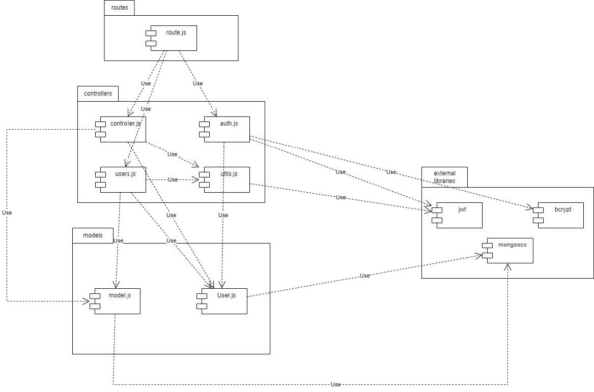
## Function Dependencies
### Auth.js
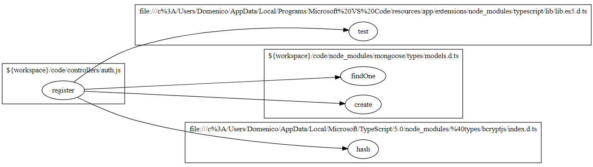
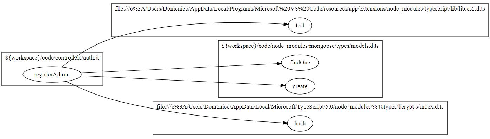
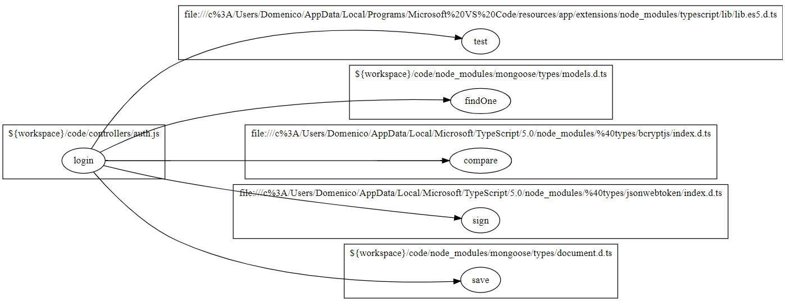
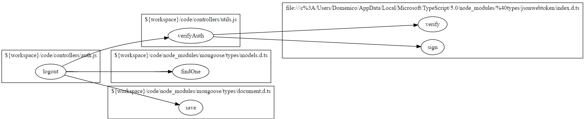
### Controller.js
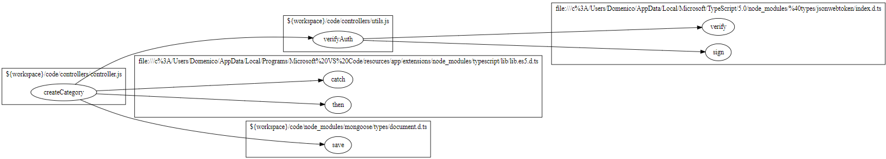
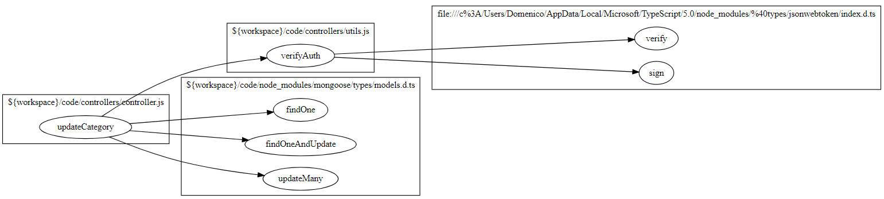
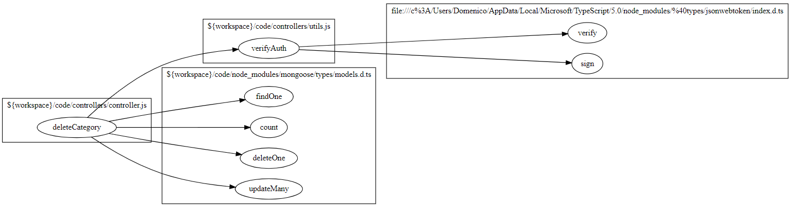
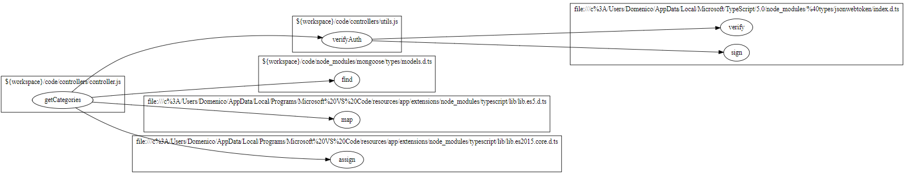
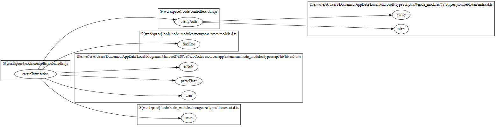
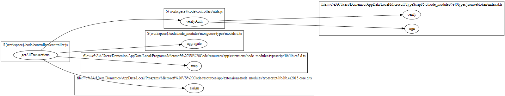
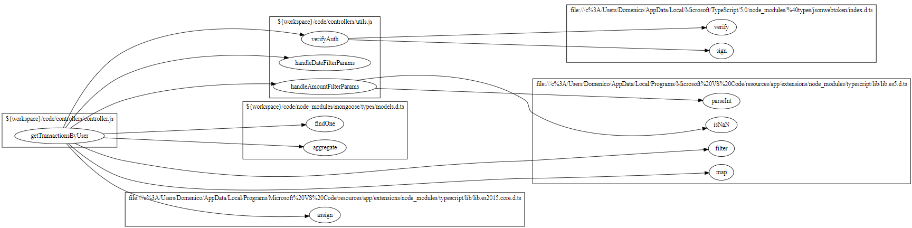
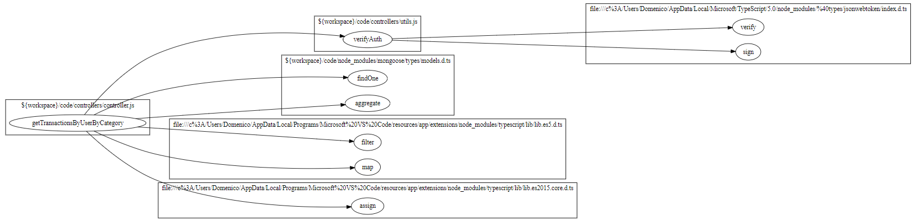
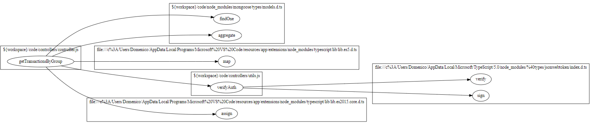
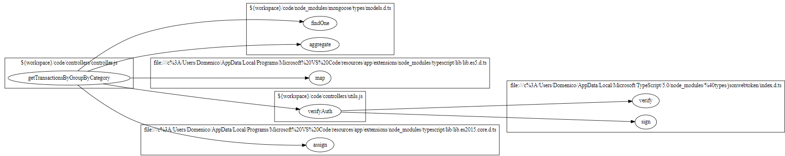
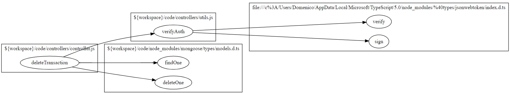
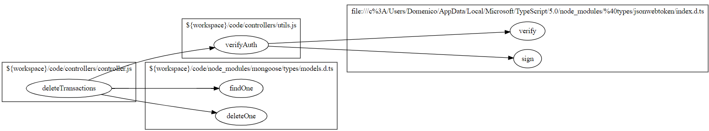
### Users.js
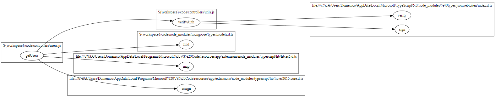
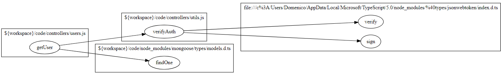
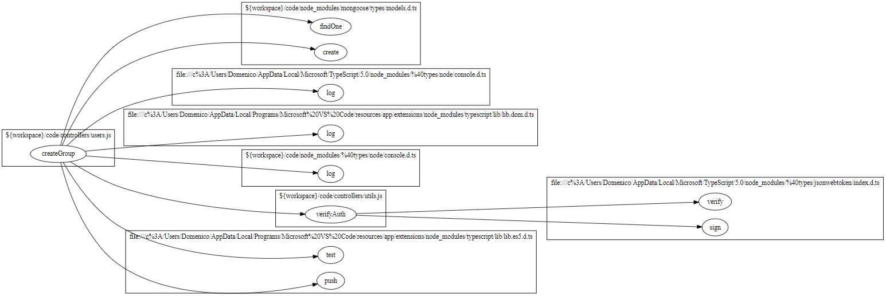
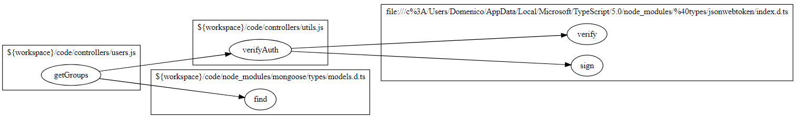
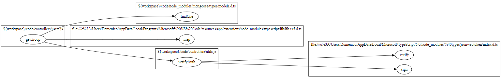
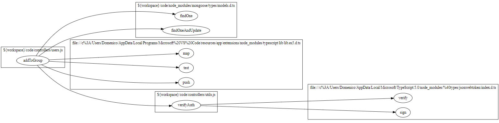
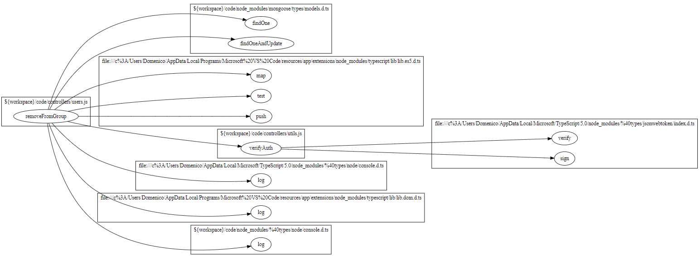

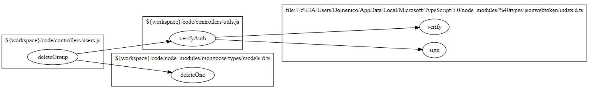
### Utils.js
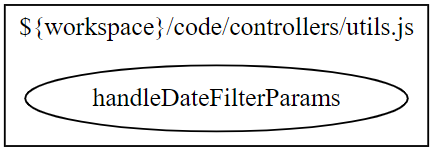
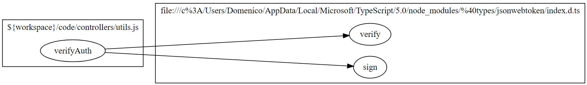
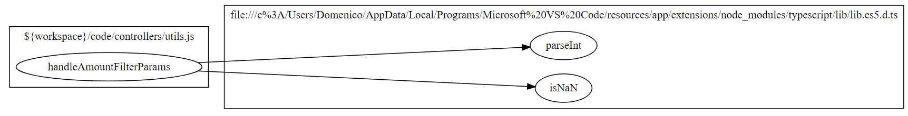
# Integration approach

    We first started from unit testing by testing progressively all the functions, then we moved towards integration testing. For integration testing, we followed more or less the same approach, so we wrote progressively all the integration tests for all the functions.

# Tests

## auth.unit.test
| Test case name | Object(s) tested | Test level | Technique used |
|--|--|--|--|
|Register an User, should register it with success|register|unit|WB/Statement Coverage|
|Register an User with missing body parameters, should return 400|register|unit|WB/Statement Coverage|
|Register an User with empty string body parameters, should return 400|register|unit|WB/Statement Coverage|
|Register an User with wrong email format, should return 400|register|unit|WB/Statement Coverage|
|Register an User, username already existing, should return 400|register|unit|WB/Statement Coverage|
|Register an User, email already existing, should return 400|register|unit|WB/Statement Coverage|
|Register an Admin, should register it with success|registerAdmin|unit|WB/Statement Coverage|
|Register an Admin with missing body parameters, should return 400|registerAdmin|unit|WB/Statement Coverage|
|Register an Admin with empty string body parameters, should return 400|registerAdmin|unit|WB/Statement Coverage|
|Register an Admin with wrong email format, should return 400|registerAdmin|unit|WB/Statement Coverage|
|Register an Admin, username already existing, should return 400|registerAdmin|unit|WB/Statement Coverage|
|Register an Admin, email already existing, should return 400|registerAdmin|unit|WB/Statement Coverage|
|User Login, should register it with success|login|unit|WB/Statement Coverage|
|User Login with not all necessary attributes, should return 400|login|unit|WB/Statement Coverage|
|User Login with at least one of the parameters in the request body as an empty string, should return 400|login|unit|WB/Statement Coverage|
|User Login with the email not in a valid format, should return 400|login|unit|WB/Statement Coverage|
|User Login with the email in the request body that does not identify a user in database, should return 400|login|unit|WB/Statement Coverage|
|User Login with the password that does not match with the one in the database, should return 400|login|unit|WB/Statement Coverage|
|User Logout, should logout with success|logout|unit|WB/Statement Coverage|
|User Logout with no refresh token in the request, should return with 400|logout|unit|WB/Statement Coverage|
|User Logout with the refresh token that does not represent a user in the database, should return with 400|logout|unit|WB/Statement Coverage|
## controller.unit.test
| Test case name | Object(s) tested | Test level | Technique used |
|--|--|--|--|
|Should return the created category|createCategory|unit|WB/Statement Coverage|
|Should return error if the request body does not contain all the necessary attributes|createCategory|unit|WB/Statement Coverage|
|Should return error if at least one of the parameters in the request body is an empty string|createCategory|unit|WB/Statement Coverage|
|Should return error if the type of category passed in the request body represents an already existing category in the database|createCategory|unit|WB/Statement Coverage|
|Should return error if called by an authenticated user who is not an admin (authType = Admin)|createCategory|unit|WB/Statement Coverage|
|Should update category successfully and return also the number of transactions whose type changed|updateCategory|unit|WB/Statement Coverage|
|Should return error if the request body does not contain all the necessary attributes|updateCategory|unit|WB/Statement Coverage|
|Should return error if at least one of the parameters in the request body is an empty string|updateCategory|unit|WB/Statement Coverage|
|Should return error if the type of category passed as a route parameter does not represent a category in the database|updateCategory|unit|WB/Statement Coverage|
|Should return error if the type of category passed in the request body as the new type represents an already existing category in the database and that category is not the same as the requested one|updateCategory|unit|WB/Statement Coverage|
|Should return error if called by an authenticated user who is not an admin (authType = Admin)|updateCategory|unit|WB/Statement Coverage|
|Should delete successfully the given categories N > T|deleteCategory|unit|WB/Statement Coverage|
|Should delete successfully the given categories N == T|deleteCategory|unit|WB/Statement Coverage|
|Should return error if the array passed in the request body is empty|deleteCategory|unit|WB/Statement Coverage|
|Should return error if the request body does not contain all the necessary attributes|deleteCategory|unit|WB/Statement Coverage|
|Should return error if called when there is only one category in the database|deleteCategory|unit|WB/Statement Coverage|
|Should return error if at least one of the types in the array is an empty string|deleteCategory|unit|WB/Statement Coverage|
|Should return error if at least one of the types in the array does not represent a category in the database|deleteCategory|unit|WB/Statement Coverage|
|Should return error if called by an authenticated user who is not an admin (authType = Admin)|deleteCategory|unit|WB/Statement Coverage|
|Should return all the categories on database|getCategories|unit|WB/Statement Coverage|
|Should return error if called by a user who is not authenticated (authType = Simple)|getCategories|unit|WB/Statement Coverage|
|Should return a 200 response and save the transaction for authorized user with valid data|createTransaction|unit|WB/Statement Coverage|
|should return a 400 error if the request body does not contain all the necessary attributes|createTransaction|unit|WB/Statement Coverage|
|should return a 400 error if at least one of the parameters in the request body is an empty string|createTransaction|unit|WB/Statement Coverage|
|should return a 400 error if the username passed in the request body is not equal to the one passed as a route parameter|createTransaction|unit|WB/Statement Coverage|
|should return a 400 error if the username passed in the request body does not represent a user in the database|createTransaction|unit|WB/Statement Coverage|
|should return a 400 error if the amount passed in the request body cannot be parsed as a floating value|createTransaction|unit|WB/Statement Coverage|
|should return a 400 error if the category passed in the request body does not exists|createTransaction|unit|WB/Statement Coverage|
|should return a 401 error if called by an authenticated user who is not the same user as the one in the route parameter|createTransaction|unit|WB/Statement Coverage|
|should return transactions with category information for Admin (200)|getAllTransactions|unit|WB/Statement Coverage|
|should return error for non-admin users (401)|getAllTransactions|unit|WB/Statement Coverage|
|should return error for unexpected errors (500)|getAllTransactions|unit|WB/Statement Coverage|
|should return transactions with status code 200|getTransactionsByUser|unit|WB/Statement Coverage|
|should return transactions with status code 200 as Admin (without filtering)|getTransactionsByUser|unit|WB/Statement Coverage|
|username passed as a route parameter does not represent a user in the database, should return 400|getTransactionsByUser|unit|WB/Statement Coverage|
|authenticated user who is not the same user as the one in the route (authType = User), should return 401|getTransactionsByUser|unit|WB/Statement Coverage|
|authenticated user who is not an admin (authType = Admin), should return 401|getTransactionsByUser|unit|WB/Statement Coverage|
|should return transactions with status code 200|getTransactionsByUserByCategory|unit|WB/Statement Coverage|
|username passed as a route parameter does not represent a user in the database, should return 400|getTransactionsByUserByCategory|unit|WB/Statement Coverage|
|category passed as a route parameter does not represent a category in the database, should return 400|getTransactionsByUserByCategory|unit|WB/Statement Coverage|
|authenticated user who is not the same user as the one in the route (authType = User), should return 401|getTransactionsByUserByCategory|unit|WB/Statement Coverage|
|authenticated user who is not an admin (authType = Admin), should return 401|getTransactionsByUserByCategory|unit|WB/Statement Coverage|
|should return 200|getTransactionsByGroup|unit|WB/Statement Coverage|
|group not found in the database, should return 400|getTransactionsByGroup|unit|WB/Statement Coverage|
|user not part of the group (authTupe=Group), should return 401|getTransactionsByGroup|unit|WB/Statement Coverage|
|user not an Admin (authTupe=Admin), should return 401|getTransactionsByGroup|unit|WB/Statement Coverage|
|getTransactionsByGroupByCategory, should return 200|getTransactionsByGroupByCategory|unit|WB/Statement Coverage|
|getTransactionsByGroupByCategory with group not found in the database, should return 400|getTransactionsByGroupByCategory|unit|WB/Statement Coverage|
|getTransactionsByGroupByCategory with category not found in the database, should return 400|getTransactionsByGroupByCategory|unit|WB/Statement Coverage|
|getTransactionsByGroupByCategory with user not in the group, should return 401|getTransactionsByGroupByCategory|unit|WB/Statement Coverage|
|getTransactionsByGroupByCategory with user not an admin, should return 401|getTransactionsByGroupByCategory|unit|WB/Statement Coverage|
|deleteTransaction, should delete the transaction with success|deleteTransaction|unit|WB/Statement Coverage|
|deleteTransaction with body that does not contain all the necessary attributes, should return 400|deleteTransaction|unit|WB/Statement Coverage|
|deleteTransaction with id in the request body that is an empty string, should return 400|deleteTransaction|unit|WB/Statement Coverage|
|deleteTransaction with username passed as a route parameter that does not represent a user in the database, should return 400|deleteTransaction|unit|WB/Statement Coverage|
|deleteTransaction with the _id in the request body that does not represent a transaction in the database, should return 400|deleteTransaction|unit|WB/Statement Coverage|
|deleteTransaction with the _id in the request body that represents a transaction made by a different user than the one in the route, should return 400|deleteTransaction|unit|WB/Statement Coverage|
|deleteTransaction called by an authenticated user who is not the same user as the one in the route (authType = User), should return 401|deleteTransaction|unit|WB/Statement Coverage|
|deleteTransactions, should delete all transactions with success|deleteTransactions|unit|WB/Statement Coverage|
|deleteTransactions with body without all necessary attributes, should return 400|deleteTransactions|unit|WB/Statement Coverage|
|deleteTransactions with at least one of the ids in the array is an empty string, should return 400|deleteTransactions|unit|WB/Statement Coverage|
|deleteTransactions with at least one of the ids in the array does not represent a transaction in the database, should return 400|deleteTransactions|unit|WB/Statement Coverage|
|deleteTransactions not called by an Admin, should return 401|deleteTransactions|unit|WB/Statement Coverage|
## users.unit.test
| Test case name | Object(s) tested | Test level | Technique used |
|--|--|--|--|
|should return empty list if there are no users|getUsers|unit|WB/Statement Coverage|
|should retrieve list of all users|getUsers|unit|WB/Statement Coverage|
|Should return error if not authorized|getUsers|unit|WB/Statement Coverage|
|should retrieve the requested username by User|getUser|unit|WB/Statement Coverage|
|should retrieve the requested username by Admin|getUser|unit|WB/Statement Coverage|
|should return error if user not found|getUser|unit|WB/Statement Coverage|
|should return error if authenticated user mismatch with username and is not admin|getUser|unit|WB/Statement Coverage|
|should return a group object, with empty array for members already in group and for members not found|createGroup|unit|WB/Statement Coverage|
|should return a group object, with non-empty array for members already in group and for members not found|createGroup|unit|WB/Statement Coverage|
|should return error if there is already a group with the same name|createGroup|unit|WB/Statement Coverage|
|should return error if all the member emails do not exist or are already in a group|createGroup|unit|WB/Statement Coverage|
|should return error if request body does not have all the necessary attributes|createGroup|unit|WB/Statement Coverage|
|should return error if the group name passed in the request body is an empty string|createGroup|unit|WB/Statement Coverage|
|should return error if the user passed in the request body does not exist|createGroup|unit|WB/Statement Coverage|
|should return error if the user who calls the API is already in a group|createGroup|unit|WB/Statement Coverage|
|should return error if at least one of the member emails is not in a valid email format|createGroup|unit|WB/Statement Coverage|
|should return error if at least one of the member emails is an empty string|createGroup|unit|WB/Statement Coverage|
|should return error if called by a user who is not authenticated|createGroup|unit|WB/Statement Coverage|
|should return empty list if there are no groups|getGroups|unit|WB/Statement Coverage|
|should retrieve list of all groups|getGroups|unit|WB/Statement Coverage|
|should return error if not authorized|getGroups|unit|WB/Statement Coverage|
|should retrieve the requested group by user |getGroup|unit|WB/Statement Coverage|
|should return error if group not found|getGroup|unit|WB/Statement Coverage|
|should return error if authenticated user is not inside the group and is not an admin|getGroup|unit|WB/Statement Coverage|
|should insert requested members into group by admin|addToGroup|unit|WB/Statement Coverage|
|should insert requested members into group by user|addToGroup|unit|WB/Statement Coverage|
|should return error if the request body does not contain all the necessary attributes|addToGroup|unit|WB/Statement Coverage|
|should return error if the group name passed as a route parameter does not represent a group in the database|addToGroup|unit|WB/Statement Coverage|
|should return error if all the provided emails represent users that are already in a group or do not exist in the database|addToGroup|unit|WB/Statement Coverage|
|should return error if at least one of the member emails is not in a valid email format|addToGroup|unit|WB/Statement Coverage|
|should return error if at least one of the member emails is an empty string|addToGroup|unit|WB/Statement Coverage|
|should return error if called by an authenticated user who is not part of the group (authType = Group)|addToGroup|unit|WB/Statement Coverage|
|should return error if called by an authenticated user who is not an admin (authType = Admin)|addToGroup|unit|WB/Statement Coverage|
|Should return a 200 response and delete the specified user from the group|removeFromGroup|unit|WB/Statement Coverage|
|should return a 400 error if the group is not found|removeFromGroup|unit|WB/Statement Coverage|
|should return a 400 error if the request body does not contain all the necessary attributes|removeFromGroup|unit|WB/Statement Coverage|
|should return a 400 error if the group is not found|removeFromGroup|unit|WB/Statement Coverage|
|should return a 400 error if all the provided emails represent user do not exist in the database|removeFromGroup|unit|WB/Statement Coverage|
|should return a 400 error if all the provided emails represent users that do not belong to the group |removeFromGroup|unit|WB/Statement Coverage|
|should return a 400 error if at least one of the emails is not in a valid email format|removeFromGroup|unit|WB/Statement Coverage|
|should return a 400 error if at least one of the emails is an empty string|removeFromGroup|unit|WB/Statement Coverage|
|should return a 400 error if the group contains only one member before deleting any user|removeFromGroup|unit|WB/Statement Coverage|
|should return a 401 error if called by an authenticated user who is not part of the group (authType = Group) /remove|removeFromGroup|unit|WB/Statement Coverage|
|should return a 401 error called by an authenticated user who is not an admin (authType = Admin) /pull|removeFromGroup|unit|WB/Statement Coverage|
|Should successfully delete the given user who does not belongs to a group|deleteUser|unit|WB/Statement Coverage|
|Should successfully delete the given user who was with other member in a group|deleteUser|unit|WB/Statement Coverage|
|Should successfully delete the given user who was alone in a group|deleteUser|unit|WB/Statement Coverage|
|Should return error if the request body does not contain all the necessary attributes|deleteUser|unit|WB/Statement Coverage|
|Should return error if the email passed in the request body is an empty string|deleteUser|unit|WB/Statement Coverage|
|Should return error if the email passed in the request body is not in correct email format|deleteUser|unit|WB/Statement Coverage|
|Should return error if the email passed in the request body does not represent a user in the database|deleteUser|unit|WB/Statement Coverage|
|Should return error if the email passed in the request body represents an admin|deleteUser|unit|WB/Statement Coverage|
|Should return error if called by an authenticated user who is not an admin|deleteUser|unit|WB/Statement Coverage|
|should successfully delete existing group|deleteGroup|unit|WB/Statement Coverage|
|should return error if the request body does not contain all the necessary attributes|deleteGroup|unit|WB/Statement Coverage|
|should return error if the name passed in the request body is an empty string|deleteGroup|unit|WB/Statement Coverage|
|should return error if the name passed does not represent a group|deleteGroup|unit|WB/Statement Coverage|
|should return error if called by an authenticated user who is not an admin (authType = Admin)|deleteGroup|unit|WB/Statement Coverage|

## utils.unit.test
| Test case name | Object(s) tested | Test level | Technique used |
|--|--|--|--|
|Should return the correct filter object when filtering by date|handleDateFilterParams|unit|WB/Statement Coverage|
|Should return the correct filter object when filtering by upTo|handleDateFilterParams|unit|WB/Statement Coverage|
|Should return the correct filter object when filtering by from|handleDateFilterParams|unit|WB/Statement Coverage|
|Should return the correct filter object when filtering from a date to an other|handleDateFilterParams|unit|WB/Statement Coverage|
|Should return an empty object when no query parameters are passed|handleDateFilterParams|unit|WB/Statement Coverage|
|Should throws an error when are present both date and from |handleDateFilterParams|unit|WB/Statement Coverage|
|Should throws an error when are present both date and upTo |handleDateFilterParams|unit|WB/Statement Coverage|
|Should throws an error when are present  date, from and upTo|handleDateFilterParams|unit|WB/Statement Coverage|
|should throw an error when date is not valid|handleDateFilterParams|unit|WB/Statement Coverage|
|should throw an error when upTo is not valid|handleDateFilterParams|unit|WB/Statement Coverage|
|should throw an error when from is not valid|handleDateFilterParams|unit|WB/Statement Coverage|
|should throw an error when from or upTo are not valid but both defined|handleDateFilterParams|unit|WB/Statement Coverage|
|Should return the correct result when authentication is successful using Simple authType|verifyAuth|unit|WB/Statement Coverage|
|Should not return the correct result when authentication is not successful using Simple authType|verifyAuth|unit|WB/Statement Coverage|
|Should return non authorized when accessToken or  refreshToken are not both defined|verifyAuth|unit|WB/Statement Coverage|
|Should return non authorized when accessToken has missing information|verifyAuth|unit|WB/Statement Coverage|
|Should return non authorized when refreshToken has missing information|verifyAuth|unit|WB/Statement Coverage|
|should return the correct result when authentication is successful using User authType and matching username|verifyAuth|unit|WB/Statement Coverage|
|should return "Mismatched users" when accessToken have a username different from the requested one using User authType|verifyAuth|unit|WB/Statement Coverage|
|should return "Mismatched users" when accessToken have a username different from the requested one using User authType|verifyAuth|unit|WB/Statement Coverage|
|should return "Mismatched users" when refreshToken have a username different from the requested one using User authType|verifyAuth|unit|WB/Statement Coverage|
|should return "Token Expired: Mismatched users" when access token is expired and mismatched users for Regular authType|verifyAuth|unit|WB/Statement Coverage|
|should return the correct result when access token is expired and the refreshToken has a username equal to the requested one for Regular authType|verifyAuth|unit|WB/Statement Coverage|
|Should return the correct result when authentication is successful using Admin authType|verifyAuth|unit|WB/Statement Coverage|
|Should return "Admin: Mismatched role" when the accessToken have a role which is not Admin using Admin authType|verifyAuth|unit|WB/Statement Coverage|
|Should return "Admin: Mismatched role" when the refreshToken have a role which is not Admin using Admin authType|verifyAuth|unit|WB/Statement Coverage|
|Should return non authorized when accessToken is expired and  the refreshToken have a role which is not Admin using Admin authType|verifyAuth|unit|WB/Statement Coverage|
|Should return authorized when accessToken is expired and the refreshToken have a role which is Admin using Admin authType|verifyAuth|unit|WB/Statement Coverage|
|should return Authorized when accessToken and  refreshToken have a email which is in group for Group authType|verifyAuth|unit|WB/Statement Coverage|
|should return not Authorized when accessToken has a email which is not in group for Group authType|verifyAuth|unit|WB/Statement Coverage|
|should return not Authorized when refreshToken has a email which is not in group for Group authType|verifyAuth|unit|WB/Statement Coverage|
|should return not Authorized when accessToken is expired and  refreshToken has a email which is not in group for Group authType|verifyAuth|unit|WB/Statement Coverage|
|should return Authorized when accessToken is expired and  refreshToken has a email which is in group for Group authType|verifyAuth|unit|WB/Statement Coverage|
|should return not Authorized when access and refresh token are both expired (Simple)|verifyAuth|unit|WB/Statement Coverage|
|should return not Authorized when access and refresh token are both expired (Group)|verifyAuth|unit|WB/Statement Coverage|
|should return the correct filter object when filtering by min amount only|handleAmountFilterParams|unit|WB/Statement Coverage|
|should return the correct filter object when filtering by max amount only|handleAmountFilterParams|unit|WB/Statement Coverage|
|should return the correct filter object when filtering by min and max amount|handleAmountFilterParams|unit|WB/Statement Coverage|
|should throw an error when min value is not valid|handleAmountFilterParams|unit|WB/Statement Coverage|
|should throw an error when max value is not valid|handleAmountFilterParams|unit|WB/Statement Coverage|
|should throw an error when max or min are not valid but are both defined|handleAmountFilterParams|unit|WB/Statement Coverage|
|should return an empty object when max and min are not defined|handleAmountFilterParams|unit|WB/Statement Coverage|
## auth.integration.test
| Test case name | Object(s) tested | Test level | Technique used |
|--|--|--|--|
|register: register a user with success|register|integration|WB/Statement Coverage|
|register: 400 error if the request body does not contain all the necessary attributes|register|integration|WB/Statement Coverage|
|register: 400 error if at least one of the parameters in the request body is an empty string|register|integration|WB/Statement Coverage|
|register: 400 error if the email in the request body is not in a valid email format|register|integration|WB/Statement Coverage|
|register: 400 error if the username in the request body identifies an already existing user|register|integration|WB/Statement Coverage|
|register: 400 error if the email in the request body identifies an already existing user|register|integration|WB/Statement Coverage|
|registerAdmin: register a user with success|registerAdmin|integration|WB/Statement Coverage|
|registerAdmin: 400 error if the request body does not contain all the necessary attributes|registerAdmin|integration|WB/Statement Coverage|
|registerAdmin: 400 error if at least one of the parameters in the request body is an empty string|registerAdmin|integration|WB/Statement Coverage|
|registerAdmin: 400 error if the email in the request body is not in a valid email format|registerAdmin|integration|WB/Statement Coverage|
|registerAdmin: 400 error if the username in the request body identifies an already existing user|registerAdmin|integration|WB/Statement Coverage|
|registerAdmin: 400 error if the email in the request body identifies an already existing user|registerAdmin|integration|WB/Statement Coverage|
|login: login with success|login|integration|WB/Statement Coverage|
|login: 400 error if the request body does not contain all the necessary attributes|login|integration|WB/Statement Coverage|
|login: 400 error if at least one of the parameters in the request body is an empty string|login|integration|WB/Statement Coverage|
|login: 400 error if the email in the request body is not in a valid email format|login|integration|WB/Statement Coverage|
|login: 400 error if the email in the request body does not identify a user in the database|login|integration|WB/Statement Coverage|
|login: 400 error if the supplied password does not match with the one in the database|login|integration|WB/Statement Coverage|
|logout: logout with success|logout|integration|WB/Statement Coverage|
|logout: 400 error if the request does not have a refresh token in the cookies|logout|integration|WB/Statement Coverage|
|logout: 400 error if the refresh token in the request cookies does not represent a user in the database|logout|integration|WB/Statement Coverage|
## controller.integration.test
| Test case name | Object(s) tested | Test level | Technique used |
|--|--|--|--|
|Returns the created category|createCategory|integration|WB/Statement Coverage|
|Returns a 400 error if the request body does not contain all the necessary attributes|createCategory|integration|WB/Statement Coverage|
|Returns a 400 error if at least one of the parameters in the request body is an empty string|createCategory|integration|WB/Statement Coverage|
|Returns a 400 error if the type of category passed in the request body represents an already existing category in the database|createCategory|integration|WB/Statement Coverage|
|Returns a 401 error if called by an authenticated user who is not an admin (authType = Admin)|createCategory|integration|WB/Statement Coverage|
|Returns a message for confirmation and the number of updated transactions|updateCategory|integration|WB/Statement Coverage|
|Returns a 400 error if the type of the new category is the same as one that exists already and that category is not the requested one|updateCategory|integration|WB/Statement Coverage|
|Returns a 400 error if the request body does not contain all the necessary parameters|updateCategory|integration|WB/Statement Coverage|
|Returns a 400 error if at least one of the parameters in the request body is an empty string|updateCategory|integration|WB/Statement Coverage|
|Returns a 400 error if the category does not exists|updateCategory|integration|WB/Statement Coverage|
|Returns a 401 error if called by a user who is not an Admin|updateCategory|integration|WB/Statement Coverage|
|Returns a 400 error if the type of category passed as a route parameter does not represent a category in the database|updateCategory|integration|WB/Statement Coverage|
|TODO|deleteCategory|integration|WB/Statement Coverage|
|Returns all the categories on database|getCategories|integration|WB/Statement Coverage|
|Returns error if called by a user who is not authenticated (authType = Simple)|getCategories|integration|WB/Statement Coverage|
|Create transaction successfully|createTransaction|integration|WB/Statement Coverage|
|Missing parameters|createTransaction|integration|WB/Statement Coverage|
|Empty string parameters|createTransaction|integration|WB/Statement Coverage|
|Category does not exist|createTransaction|integration|WB/Statement Coverage|
|Mismatched usernames|createTransaction|integration|WB/Statement Coverage|
|User does not exist|createTransaction|integration|WB/Statement Coverage|
|Invalid amount|createTransaction|integration|WB/Statement Coverage|
| Returns 401 error when unauthorized|createTransaction|integration|WB/Statement Coverage|
|Returns all transactions when you are admin|getAllTransactions|integration|WB/Statement Coverage|
|Returns unauthorized error for non-admin|getAllTransactions|integration|WB/Statement Coverage|
|should return transactions for a specific user|getTransactionsByUser|integration|WB/Statement Coverage|
|should return transactions for a specific user without filtering (Admin)|getTransactionsByUser|integration|WB/Statement Coverage|
|400 error if the username passed as a route parameter does not represent a user in the database|getTransactionsByUser|integration|WB/Statement Coverage|
|401 error if called by an authenticated user who is not the same user as the one in the route (authType = User) if the route is /api/users/:username/transactions|getTransactionsByUser|integration|WB/Statement Coverage|
|Returns a 401 error if called by an authenticated user who is not an admin (authType = Admin) if the route is /api/transactions/users/:username|getTransactionsByUser|integration|WB/Statement Coverage|
|should return transactions for a specific user and category|getTransactionsByUserByCategory|integration|WB/Statement Coverage|
|400 error if the username passed as a route parameter does not represent a user in the database|getTransactionsByUserByCategory|integration|WB/Statement Coverage|
|400 error if the category passed as a route parameter does not represent a category in the database|getTransactionsByUserByCategory|integration|WB/Statement Coverage|
|401 error if called by an authenticated user who is not the same user as the one in the route (authType = User) if the route is /api/users/:username/transactions/category/:category|getTransactionsByUserByCategory|integration|WB/Statement Coverage|
|401 error if called by an authenticated user who is not an admin (authType = Admin) if the route is /api/transactions/users/:username/category/:category|getTransactionsByUserByCategory|integration|WB/Statement Coverage|
|should return transactions for a specific group|getTransactionsByGroup|integration|WB/Statement Coverage|
|400 error if the group name passed as a route parameter does not represent a group in the database|getTransactionsByGroup|integration|WB/Statement Coverage|
|401 error if called by an authenticated user who is not part of the group (authType = Group) if the route is /api/groups/:name/transactions|getTransactionsByGroup|integration|WB/Statement Coverage|
|401 error if called by an authenticated user who is not an admin (authType = Admin) if the route is /api/transactions/groups/:name|getTransactionsByGroup|integration|WB/Statement Coverage|
|should get all transactions of a certain group and a certain category|getTransactionsByGroupByCategory|integration|WB/Statement Coverage|
|400 error if the group name passed as a route parameter does not represent a group in the database|getTransactionsByGroupByCategory|integration|WB/Statement Coverage|
|400 error if the category passed as a route parameter does not represent a category in the database|getTransactionsByGroupByCategory|integration|WB/Statement Coverage|
|401 error if called by an authenticated user who is not part of the group (authType = Group) if the route is /api/groups/:name/transactions/category/:category|getTransactionsByGroupByCategory|integration|WB/Statement Coverage|
|401 error if called by an authenticated user who is not an admin (authType = Admin) if the route is /api/transactions/groups/:name/category/:category|getTransactionsByGroupByCategory|integration|WB/Statement Coverage|
|should delete transaction when user authentication is successful and valid ID is provided|deleteTransaction|integration|WB/Statement Coverage|
|400 error if the request body does not contain all the necessary attributes|deleteTransaction|integration|WB/Statement Coverage|
|400 error if the _id in the request body is an empty string|deleteTransaction|integration|WB/Statement Coverage|
|400 error if the username passed as a route parameter does not represent a user in the database|deleteTransaction|integration|WB/Statement Coverage|
|400 error if the _id in the request body does not represent a transaction in the database|deleteTransaction|integration|WB/Statement Coverage|
|400 error if the _id in the request body represents a transaction made by a different user than the one in the route|deleteTransaction|integration|WB/Statement Coverage|
|401 error if called by an authenticated user who is not the same user as the one in the route (authType = User)|deleteTransaction|integration|WB/Statement Coverage|
|should delete transactions when admin authentication is successful and valid IDs are provided|deleteTransactions|integration|WB/Statement Coverage|
|400 error if the request body does not contain all the necessary attributes|deleteTransactions|integration|WB/Statement Coverage|
|400 error if at least one of the ids in the array is an empty string|deleteTransactions|integration|WB/Statement Coverage|
|400 error if at least one of the ids in the array does not represent a transaction in the database|deleteTransactions|integration|WB/Statement Coverage|
|401 error if called by an authenticated user who is not an admin (authType = Admin)|deleteTransactions|integration|WB/Statement Coverage|
## users.integration.test
| Test case name | Object(s) tested | Test level | Technique used |
|--|--|--|--|
|Returns empty list if there are no users|getUsers|integration|WB/Statement Coverage|
|Returns all users in database|getUsers|integration|WB/Statement Coverage|
|Returns a 401 error if called by an authenticated user who is not an admin (authType = Admin)|getUsers|integration|WB/Statement Coverage|
|Returns the requested username by User|getUser|integration|WB/Statement Coverage|
|Returns the requested username by Admin|getUser|integration|WB/Statement Coverage|
|Returns a 400 error if the username passed as the route parameter does not represent a user in the database|getUser|integration|WB/Statement Coverage|
|Returns a 401 error if called by an authenticated user who is neither the same user as the parameter (authType = User) nor an admin (authType = Admin)|getUser|integration|WB/Statement Coverage|
|Returns the just created group, an alreadyInGroup list and a membersNotFound list|createGroup|integration|WB/Statement Coverage|
|If the user who calls the API does not have their email in the list of emails then their email is added to the list of members|createGroup|integration|WB/Statement Coverage|
|Returns a 400 error if the request body does not contain all the necessary attributes|createGroup|integration|WB/Statement Coverage|
|Returns a 400 error if the group name passed in the request body is an empty string|createGroup|integration|WB/Statement Coverage|
|Returns a 400 error if the group name passed in the request body represents an already existing group in the database|createGroup|integration|WB/Statement Coverage|
|Returns a 400 error if all the provided emails (the ones in the array, the email of the user calling the function does not have to be considered in this case) represent users that are already in a group or do not exist in the database|createGroup|integration|WB/Statement Coverage|
|Returns a 400 error if the user who calls the API is already in a group|createGroup|integration|WB/Statement Coverage|
|Returns a 400 error if at least one of the member emails is not in a valid email format|createGroup|integration|WB/Statement Coverage|
|Returns a 400 error if at least one of the member emails is an empty string|createGroup|integration|WB/Statement Coverage|
|Returns a 400 error if the user who calls does not exist in database|createGroup|integration|WB/Statement Coverage|
|Returns a 401 error if called by a user who is not authenticated (authType = Simple)|createGroup|integration|WB/Statement Coverage|
|Returns all groups on database|getGroups|integration|WB/Statement Coverage|
|Returns a 401 error if called by an authenticated user who is not an admin (authType = Admin)|getGroups|integration|WB/Statement Coverage|
|Returns the requested group|getGroup|integration|WB/Statement Coverage|
|Returns a 400 error if the group name passed as a route parameter does not represent a group in the database|getGroup|integration|WB/Statement Coverage|
|Returns a 401 error if called by an authenticated user who is neither part of the group (authType = Group) nor an admin (authType = Admin)|getGroup|integration|WB/Statement Coverage|
|Inserts user into requested group as admin|addToGroup|integration|WB/Statement Coverage|
|Inserts user into requested group as user|addToGroup|integration|WB/Statement Coverage|
|Returns a 400 error if the request body does not contain all the necessary attributes|addToGroup|integration|WB/Statement Coverage|
|Returns a 400 error if the group name passed as a route parameter does not represent a group in the database|addToGroup|integration|WB/Statement Coverage|
|Returns a 400 error if all the provided emails represent users that are already in a group or do not exist in the database|addToGroup|integration|WB/Statement Coverage|
|Returns a 400 error if at least one of the member emails is not in a valid email format|addToGroup|integration|WB/Statement Coverage|
|Returns a 400 error if at least one of the member emails is an empty string|addToGroup|integration|WB/Statement Coverage|
|Returns a 401 error if called by an authenticated user who is not part of the group (authType = Group) if the route is api/groups/:name/add|addToGroup|integration|WB/Statement Coverage|
|Returns a 401 error if called by an authenticated user who is not an admin (authType = Admin) if the route is api/groups/:name/insert|addToGroup|integration|WB/Statement Coverage|
|Removes members from a group successfully|removeFromGroup|integration|WB/Statement Coverage|
|400 error if at least one of the emails is an empty string|removeFromGroup|integration|WB/Statement Coverage|
|400 error if the group contains only one member before deleting any user|removeFromGroup|integration|WB/Statement Coverage|
|401 error if called by an authenticated user who is not part of the group (authType = Group) if the route is api/groups/:name/remove|removeFromGroup|integration|WB/Statement Coverage|
|401 error if called by an authenticated user who is not an admin (authType = Admin) if the route is api/groups/:name/pull|removeFromGroup|integration|WB/Statement Coverage|
|Should successfully delete the given user who does not belongs to a group|deleteUser|integration|WB/Statement Coverage|
|Should successfully delete the given user who was with other member in a group|deleteUser|integration|WB/Statement Coverage|
|Should successfully delete the given user who was alone in a group|deleteUser|integration|WB/Statement Coverage|
|Should return error if the request body does not contain all the necessary attributes|deleteUser|integration|WB/Statement Coverage|
|Should return error if the email passed in the request body is an empty string|deleteUser|integration|WB/Statement Coverage|
|Should return error if the email passed in the request body is not in correct email format|deleteUser|integration|WB/Statement Coverage|
|Should return error if the email passed in the request body does not represent a user in the database|deleteUser|integration|WB/Statement Coverage|
|Should return error if the email passed in the request body represents an admin|deleteUser|integration|WB/Statement Coverage|
|Should return error if called by an authenticated user who is not an admin|deleteUser|integration|WB/Statement Coverage|
|Returns confirmation message|deleteGroup|integration|WB/Statement Coverage|
|Returns a 400 error if the request body does not contain all the necessary attributes|deleteGroup|integration|WB/Statement Coverage|
|Returns a 400 error if the name passed in the request body is an empty string|deleteGroup|integration|WB/Statement Coverage|
|Returns a 400 error if the name passed in the request body does not represent a group in the database|deleteGroup|integration|WB/Statement Coverage|
|Returns a 401 error if called by an authenticated user who is not an admin (authType = Admin)|deleteGroup|integration|WB/Statement Coverage|

## utils.integration.test
| Test case name | Object(s) tested | Test level | Technique used |
|--|--|--|--|
|Returns an object with a date attribute used for filtering mongoose aggregate queries - from parameter|handleDateFilterParams|integration|WB/Statement Coverage|
|Returns an object with a date attribute used for filtering mongoose aggregate queries - upTo parameter|handleDateFilterParams|integration|WB/Statement Coverage|
|Returns an object with a date attribute used for filtering mongoose aggregate queries - from and upTo parameters|handleDateFilterParams|integration|WB/Statement Coverage|
|Returns an object with a date attribute used for filtering mongoose aggregate queries - date parameter|handleDateFilterParams|integration|WB/Statement Coverage|
|Returns an empty object if there are no query parameters|handleDateFilterParams|integration|WB/Statement Coverage|
|Throws an error if date is present with from parameter|handleDateFilterParams|integration|WB/Statement Coverage|
|Throws an error if date is present with upTo parameter|handleDateFilterParams|integration|WB/Statement Coverage|
|Throws an error if the value of any query parameter is not a valid date (from only)|handleDateFilterParams|integration|WB/Statement Coverage|
|Throws an error if the value of any query parameter is not a valid date (date only)|handleDateFilterParams|integration|WB/Statement Coverage|
|Throws an error if the value of any query parameter is not a valid date (upTo only)|handleDateFilterParams|integration|WB/Statement Coverage|
|Throws an error if the value of any query parameter is not a valid date (from and upTo only)|handleDateFilterParams|integration|WB/Statement Coverage|
|Tokens are both valid and belong to the requested user|verifyAuth|integration|WB/Statement Coverage|
|Tokens are both valid and belong to the requested user with authTipe:Simple|verifyAuth|integration|WB/Statement Coverage|
|Undefined tokens|verifyAuth|integration|WB/Statement Coverage|
|Access token has missing fields|verifyAuth|integration|WB/Statement Coverage|
|Refresh token has missing fields|verifyAuth|integration|WB/Statement Coverage|
|Mismatching usernames in tokens|verifyAuth|integration|WB/Statement Coverage|
|Mismatching usernames tokens and info.username|verifyAuth|integration|WB/Statement Coverage|
|Mismatching roles in Authtype: admin|verifyAuth|integration|WB/Statement Coverage|
|Returns an object indicating unauthorized when authType is Group and user is not in the group|verifyAuth|integration|WB/Statement Coverage|
|Returns authorized when authType is Group and user is  in the group|verifyAuth|integration|WB/Statement Coverage|
|Token Expired: Mismatched users|verifyAuth|integration|WB/Statement Coverage|
|Token Expired: Mismatched roles|verifyAuth|integration|WB/Statement Coverage|
|Token Expired:Returns an object indicating unauthorized when authType is Group and user is not in the group|verifyAuth|integration|WB/Statement Coverage|
|Token Expired:Returns authorized when authType is Group and user is  in the group|verifyAuth|integration|WB/Statement Coverage|
|Generic Error (TypeError)|verifyAuth|integration|WB/Statement Coverage|
|Both Token Expired|verifyAuth|integration|WB/Statement Coverage|
|Access token expired and refresh token belonging to the requested user|verifyAuth|integration|WB/Statement Coverage|
|Returns an object with an amount attribute used for filtering mongoDBs aggregate queries - min parameter|handleAmountFilterParams|integration|WB/Statement Coverage|
|Returns an object with an amount attribute used for filtering mongoose aggregate queries - max parameter|handleAmountFilterParams|integration|WB/Statement Coverage|
|Returns an object with an amount attribute used for filtering mongoose aggregate queries - min and max parameters|handleAmountFilterParams|integration|WB/Statement Coverage|
|Throws an error if the value of any query parameter is not a numerical value - min parameter|handleAmountFilterParams|integration|WB/Statement Coverage|
|Throws an error if the value of any query parameter is not a numerical value - max parameter|handleAmountFilterParams|integration|WB/Statement Coverage|
|Throws an error if the value of any query parameter is not a numerical value but are both defined - max parameter|handleAmountFilterParams|integration|WB/Statement Coverage|
|Returns an empty object if there are no query parameters|handleAmountFilterParams|integration|WB/Statement Coverage|

# Coverage

## Coverage of FR

| Functional Requirements covered |   Test(s) | 
| ------------------------------- | ----------- | 
|  FR1    | Manage users |
| FR11                             |     UNIT(register),INTEGRATION(register)        |             
| FR12                             |     UNIT(login),INTEGRATION(login)        |             
| FR13                             |     UNIT(logout),INTEGRATION(logout)        |             
| FR14                             |     UNIT(registerAdmin),INTEGRATION(registerAdmin)        |             
| FR15                             |     UNIT(getUsers),INTEGRATION(getUsers)        |             
| FR16                             |     UNIT(getUser),INTEGRATION(getUser)        |             
| FR17                             |     UNIT(deleteUser),INTEGRATION(deleteUser)        |
|  FR2    | Manage Groups |
| FR21                             |     UNIT(createGroup),INTEGRATION(createGroup)        |             
| FR22                             |     UNIT(getGroups),INTEGRATION(getGroups)        |             
| FR23                             |     UNIT(getGroup),INTEGRATION(getGroup)        |             
| FR24                             |     UNIT(addToGroup),INTEGRATION(addToGroup)        |             
| FR26                             |     UNIT(removeFromGroup),INTEGRATION(removeFromGroup)        |             
| FR28                             |     UNIT(deleteGroup),INTEGRATION(deleteGroup)        |    
|  FR3   |  Manage  transactions|
| FR31                             |     UNIT(createTransaction),INTEGRATION(createTransaction)        |             
| FR32                             |     UNIT(getAllTransactions),INTEGRATION(getAllTransactions)        |             
| FR33                             |     UNIT(getTransactionsByUser),INTEGRATION(getTransactionsByUser)        |             
| FR34                             |     UNIT(getTransactionsByUserByCategory),INTEGRATION(getTransactionsByUserByCategory)        |             
| FR35                             |     UNIT(getTransactionsByGroup),INTEGRATION(getTransactionsByGroup)        |             
| FR36                             |     UNIT(getTransactionsByGroupByCategory),INTEGRATION(getTransactionsByGroupByCategory)        |             
| FR37                             |     UNIT(deleteTransaction),INTEGRATION(deleteTransaction)        |             
| FR38                             |     UNIT(deleteTransactions),INTEGRATION(deleteTransactions)        |        
|  FR4  |  Manage categories |
| FR41                             |     UNIT(createCategory),INTEGRATION(createCategory)        |             
| FR42                             |     UNIT(updateCategory),INTEGRATION(updateCategory)        |             
| FR43                             |     UNIT(deleteCategory),INTEGRATION(deleteCategory)        |             
| FR44                             |     UNIT(getCategories),INTEGRATION(getCategories)        |                   

## Coverage white box

